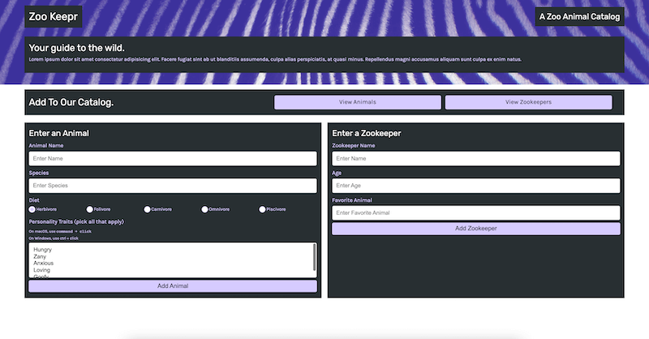
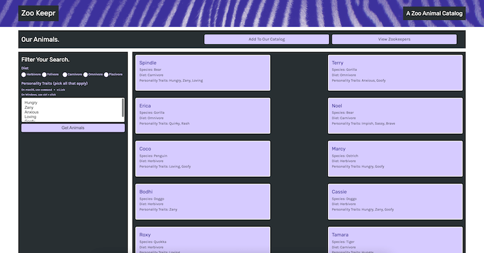
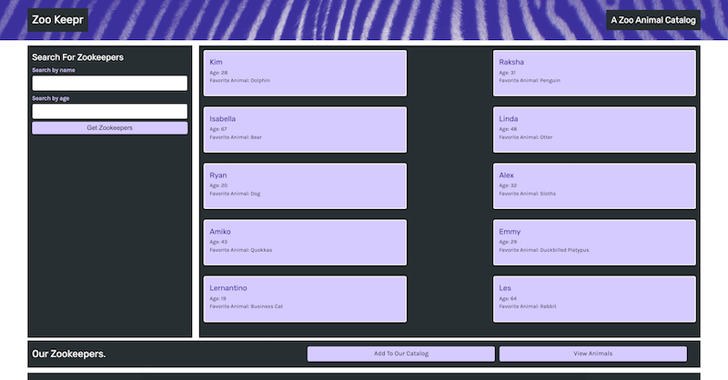

  <h1 align="center"> Note Taker  </h1>

## Description

  
You can see the project repository: <b>[here](https://github.com/mihaelavalac/zookeepers)</b> 
   You can navigate to the deployed site <b>[here](https://zookeepermv.herokuapp.com/)</b>

  
<i>The purpose of this application is to allow the zoo administration to have access to the animals and the staff in the zoo. The administration also can add a new animal or a new member in their system. While working on this project I empowered my fresh gathered knowledge of Express.js and  Node.js.</i>

## Table of Contents

- [Installation](#installation)
- [Features](#features)
- [Contributing](#contributing)
- [License](#license)
- [Questions](#questions)

## Installation

Follow the following instructions to install this project:   1. Download Nodejs to your computer.   2. Clone the project repo to your computer `git clone git@github.com:mihaelavalac/zookeepers.git`   3. Navigate to the root of the project through your text editor.   4. Open terminal and run the following command `npm init` then, `npm install express` , `npm install fs`, `npm install path`   5. Run the `npm start` to start the Express server   6. Navigate to the `http://localhost:3001/`.   7. You should see the home page like bellow.      8. Click the `View Animals` or `View Zookeepers` button to be redirected to the animal/zookeeper page where you can see all the animals and staff      

## Features
GIVEN a zookeeper application
WHEN I open the Zookeeper
THEN I am presented with a landing page with a link to an Animal Page and Zookeeper Page
WHEN I click on the link to these pages
THEN I am presented with a page with existing animals/zookeepers listed in the right-hand column, plus a form to filter the search in the left-hand column
WHEN I enter a new animal in the form o the home page  and Submit it
THEN the animal is added to the animals page
WHEN I enter a new zookeeper in the form o the home page  and Submit it
THEN the zookeeper is added to the zookeeper page
## Contributing

To contribute to the project just fork and install it on your computer, add the desired features/changes and push it back to the git. I will review the changes and merge them in the main branch.  

<b>Current Contributors:</b>  
👪 Mihaela Valac

## License

This application is covered by the <b>[GPL-2.0](https://opensource.org/licenses/GPL-2.0)</b> license.

## Questions

For questions please contact me on:  

:octocat: Github: [mihaelavalac](https://github.com/mihaelavalac)  
✉️ Email: mihaelavalac@yahoo.com 
